# Achieve Green IT targets by integrating Turbonomic with Envizi

This article covers how Organizations with a sustainability initiative can have an instant impact in their IT Operations by leveraging IBM Turbonomic with Envizi.

#### Authors
 [Mamatha Venkatesh](https://community.ibm.com/community/user/envirintel/network/members/profile?UserKey=813a3553-d5cc-4b76-9970-ed40f865cb31), [Jeya Gandhi Rajan M](https://community.ibm.com/community/user/envirintel/people/jeya-gandhi-rajan-m1)

## Green IT

Over the last decade, investor pressure, reputational risk, government legislation, and the introduction of Environmental, Social, and Governance (ESG) reporting frameworks have paved the way for organizations to drive sustainability initiatives and set decarbonization goals. 

When it comes to sustainability in business, organizations recognize the value of operating in a more sustainable and socially responsible manner.  The organizations, need to look at all areas to cover. One way to quickly improve energy efficiency, reduce cost and cut down your carbon impact is by optimizing your data center and public cloud usage. 

IT can reduce energy and environmental impact by optimizing data center and public cloud resources. We see when we look at data centers, electricity can account for as much as 70% of total data center operating costs. And we also found that typically on-prem data centers operate at only 20 to 40% utilization.  And with the rising cost of energy, organizations are looking for ways to become more energy efficient.

## IBM Turbonomic

IBM Turbonomic is an Application Resource Management solution that can help the IT Operations team to automate critical actions that proactively deliver the most efficient use of compute, storage and network resources to your apps at every layer of the stack, continuously, in real time and without human intervention. 

With IBM Turbonomic, you can make an immediate impact on energy use by optimizing how you allocate resources to applications. When applications consume only what they need to perform, you can increase utilization, reduce carbon emissions, and achieve continuously efficient operations. 

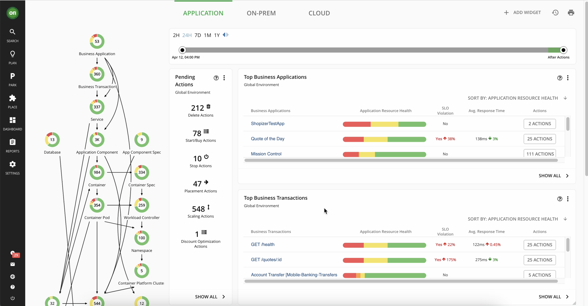

## IBM Envizi

IBM Envizi ESG Suite platform that accelerates the sustainability by managing all your environmental, social and governance (ESG) indicators in a single platform. A single system of record that delivers auditable, finance-grade ESG and sustainability data. Provides flexible reporting tools to meet internal and external ESG and sustainability reporting requirements. Integrates internal and external stakeholders, process and technology to embed sustainability into daily operations. Unlocks insights to inform the fastest and most cost-effective pathway to decarbonization.

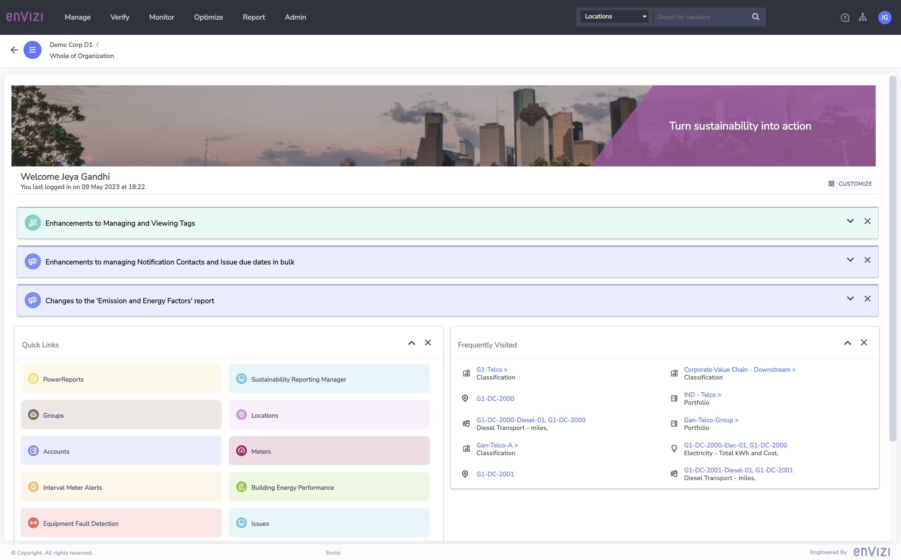

## Operationalize sustainability 

To become a sustainable business, organizations take steps to build and operationalize sustainability by:
- Defining sustainability goals – what are the clear ESG goals 
- Establish ESG foundations – determine impact, plan change and track progress 
- Operationalize sustainability goals – in three key areas, including: Intelligent assets, facilities and infrastructure, Responsible computing and IT & Sustainable supply chains and circularity. 

Here Envizi is to address the heavy lift associated with Environmental Social and Governance metrics.  The system is designed to ease the capture of sustainability related data, convert this data into useful ESG metrics such as Greenhouse Gas Emissions, and to support both reporting against both internal and external reporting frameworks.  

IBM Turbonomic falls withing the Responsible computing and green IT messaging pillar as part of the larger IBM sustainability solutions messaging. IBM Turbonomic is a no-fuss solution that helps you improve data center efficiency, performance optimization and cloud workflow tracking. 

## Turbonomic + Envizi together

Turbonomic + Envizi integration enables organizations to maintain IT operational excellence with less resources and cost; providing enterprise-wide transparency to deliver on corporate and IT sustainable goals. It provide customers with a full view of energy use and emissions from workloads in the data center.

Turbonomic captures data and updates every 10 minutes which Envizi will leverage and calculate the emissions data and report. Both the products will remain separate but will work together.

Emissions are calculated on the Envizi side. Turbo will be providing a daily roll up of energy data for hosts that Envizi will store and report on over a monthly period.

Here are the benefits out of this togetherness

- Turbonomic can help IT operations and optimize application resources to reduce energy use, utilize infrastructure and assure application performance
- Envizi creates a snapshot through a dashboard of metrics useful for environmental, social, and corporate governance (ESG) goals.
- Envizi can highlight efficiency gains from resource optimizations and reductions in energy and emissions.
- Envizi reporting shows detailed results of energy and carbon reduction changes made from IT optimization through Turbonomic and accurately provides data to Envizi for ESG reporting.

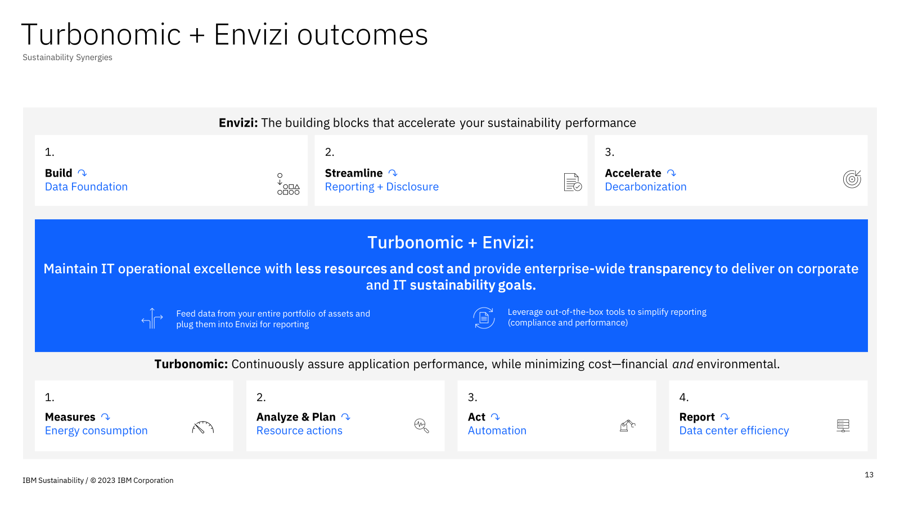

## IBM’s own data center is using IBM Turbonomic 

IBM also has published its sustainability goals, including net zero greenhouse gas emissions by 2030.

IBM Hursley’s Hyperscale Cloud Data Centre (HCDC) is one of IBM's flagship data centers consisting of a 27,000 square foot room and supporting over 11,000 developers. 

- 580 racks containing IBM development
- 4,500 physical systems, 
- 87% virtualized with a range of technologies including: 2x private developer clouds, and ~6,000 VMWare based systems
- 10 Petabytes of enterprise grade storage
- 11 mainframes including the latest z16
- 1-100G networking with direct 10G links to IBM SoftLayer

They began using IBM Turbonomic last year and saw immediate benefits.

IBM Cloud DataCentre Technical Manager & Master Inventor `Colin Holyoake` says that `When we first provisioned Turbonomic we were impressed with how quickly we got it running. One of the main benefits is that it gives assurance of your environment, continues to give actionable recommendations, while also allowing you to customize policies to match the operational approach.`

## Sustainable IT dashboard in Turbonomic

The sustainable IT dashboard, built into Turbonomic reporting that enables customers to measure their energy use and carbon output from the customers data center.

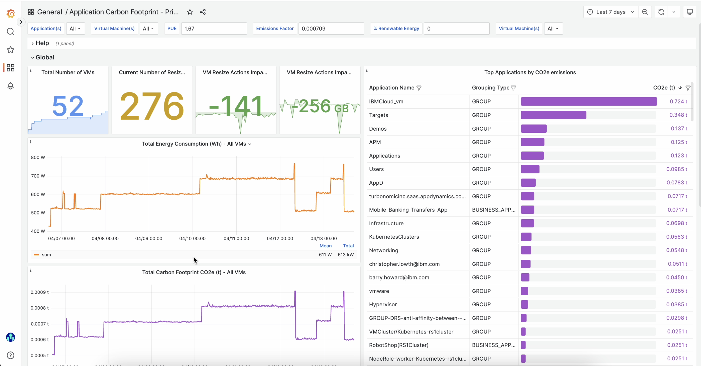
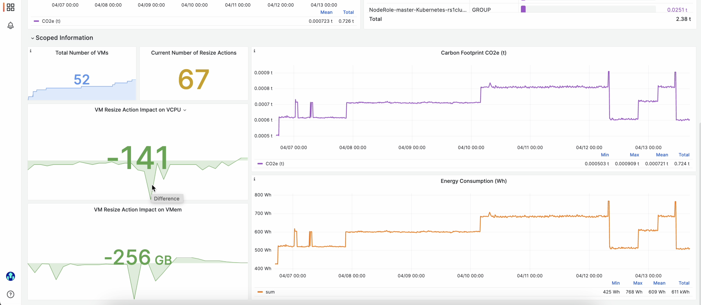

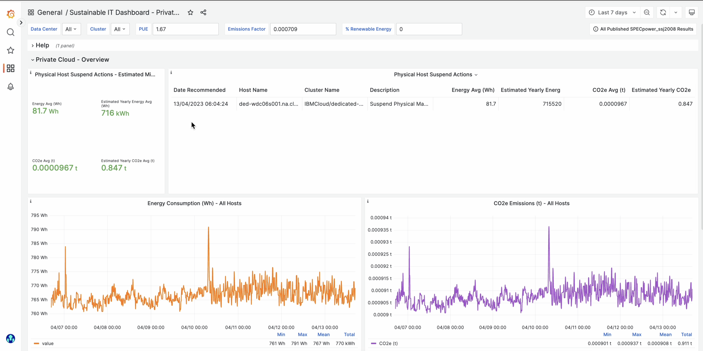
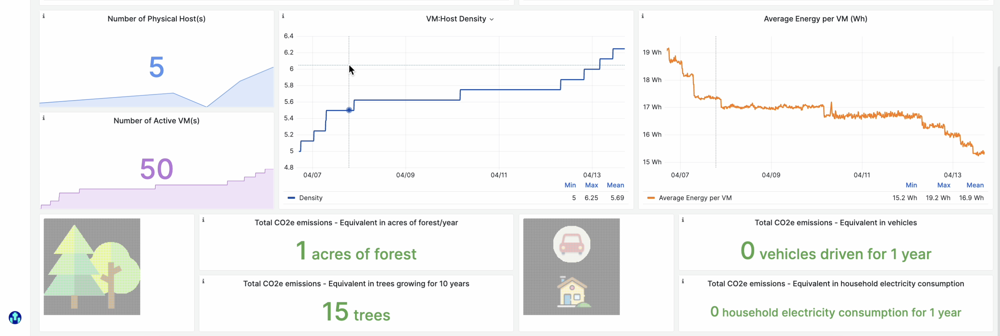
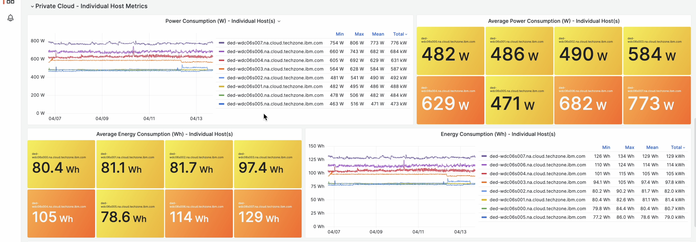
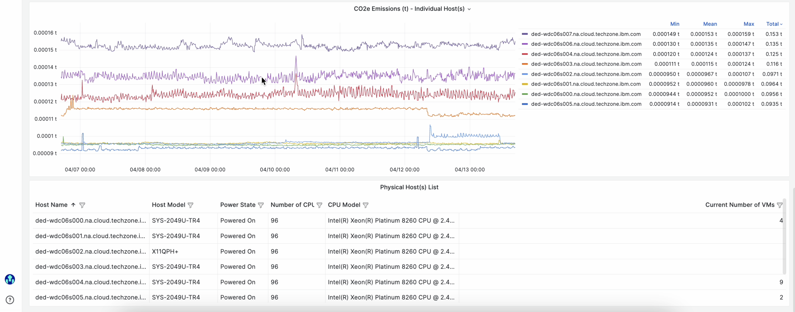

Data from the sustainable IT dashboard indicates the before and after Turbonomic actions taken measurements of energy and carbon use from the data center and show the estimated carbon impact equivalent (MTCO2, # households, # tree seedlings). This data can be leveraged by ESG reporting tools, or directly connected to Envizi to leverage for ESG reporting. This ensures carbon reporting is accurate and continuous.

Turbonomic will soon launch phase II of the sustainable IT dashboard with a new dashboard report displaying the top business applications that use the most energy (& generate the most carbon). This enables IT to identify and prioritize the business applications that need to be redeveloped or moved to a more energy efficient resource (energy efficient infrastructure or cloud).

## Turbonomic Performance Dashboard in Envizi

The Turbonomic Performance Dashboard in Envizi helps to view and compare the energy and emissions performance of your data centers and assess the performance of deploying Turbonomic Resource Optimization technology.

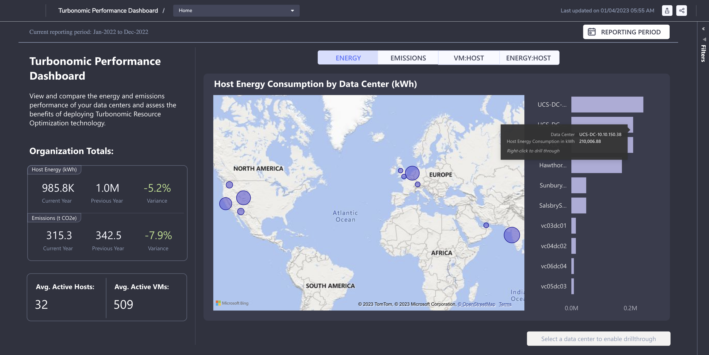
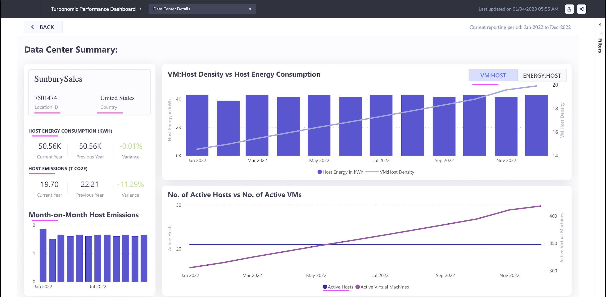

The dashboard shows the below information pertaining to Energy, Emissions, Density and etc.
- Host Energy Consumption by Data Center
- Host Emissions by Data Center
- VM:Host Density by Data Center
- Energy:Host Intensity by Data Center
- VM:Host Density vs Host Energy Consumption of a Data Center
- Energy:Host Intensity vs Host Energy Consumption of a Data Center

## Appendix

Refer the following.

#### Integrating Turbo with Envizi via AppConnect for Green IT data

This blog explains about the step-by-step instructions to pull green IT data from Turbonomic into Envizi via App Connect.

[../02-Integrating-turbo-with-envizi-via-appconnect](../02-Integrating-turbo-with-envizi-via-appconnect/)

#### Envizi - Turbonomic Performance Dashboard 

This document describes about the Turbonomic Performance Dashboard available in Envizi.

[../03-turbonomic-performance-dashaboard](../03-turbonomic-performance-dashaboard/)